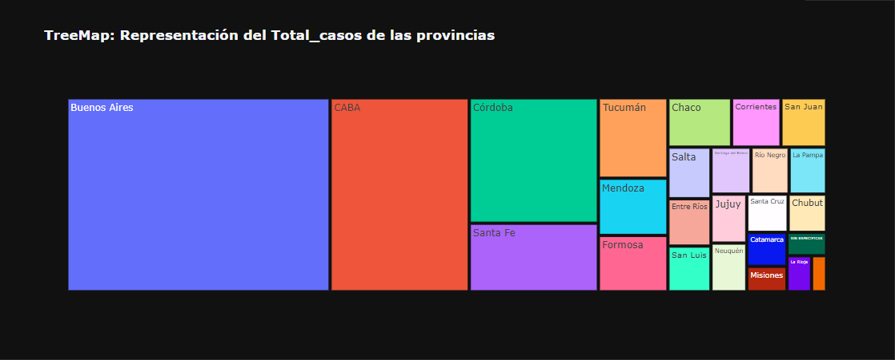
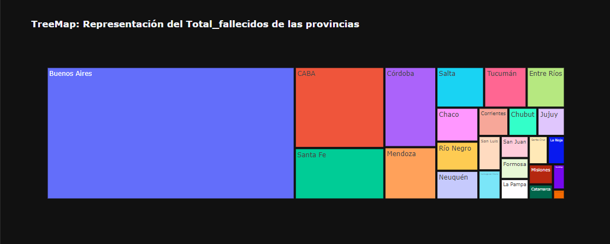
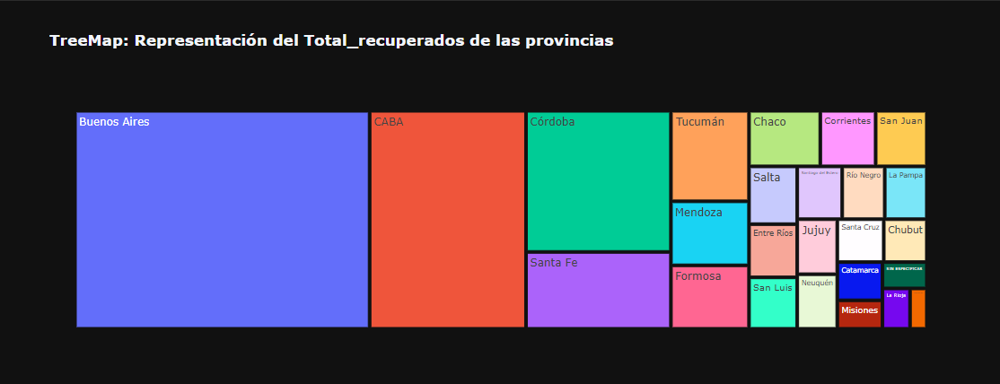
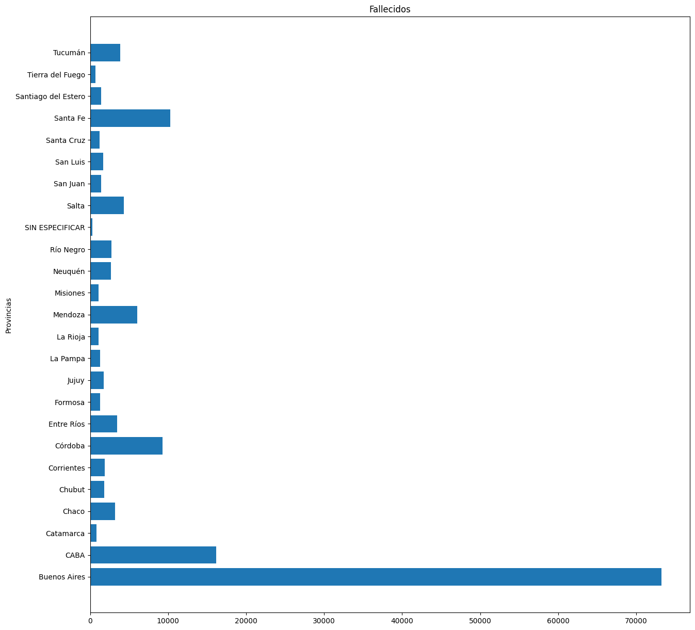
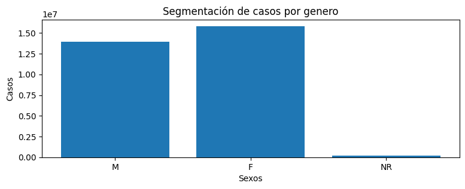
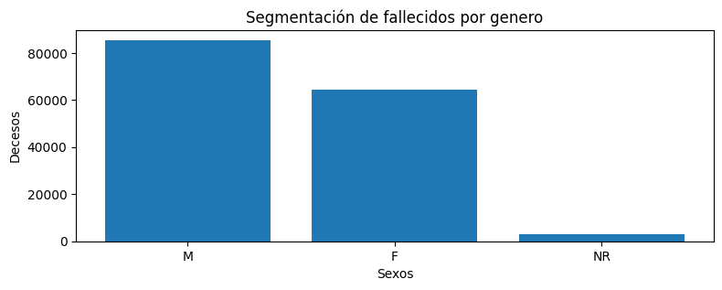
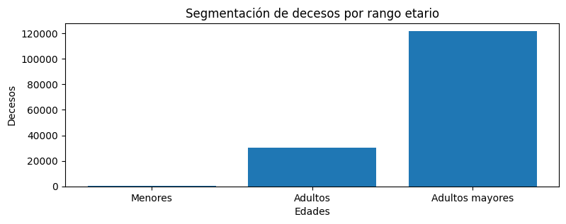

# Argentina Covid-19 Data Analysis
Este proyecto se realizó con los datos suministrados por el ministerio de salud de la nación, el cual puede ser descargado del siguiente [link.](http://datos.salud.gob.ar/dataset/covid-19-casos-registrados-en-la-republica-argentina/archivo/fd657d02-a33a-498b-a91b-2ef1a68b8d16)
___

### En este proyecto de análisis de datos, se buscó responder a los siguientes interrogantes:
- Ordenar las provincias mayor cantidad de indicadores.
- Cantidad de casos y fallecimientos, tanto a nivel nacional como provincial.
- Conformación de la masa de casos en cuanto a género y edad.

Con ello en mente, se prosiguió a realizar el siguiente análisis. El cual, se encuentra perfectamente detallado en el 
 siguiente [notebook.](analysis.ipynb)

### A modo de resumen, podemos decir que:
## 1 - De acuerdo a la cantidad de casos, las provincias se ordenan de la siguiente forma:

---

## 2 - Cantidad de casos
A nivel nacional se registraron:
- 29971992 de casos.
- 153021 de fallecidos.

De los cuales, se distribuyen de la siguiente manera:

---

## 3 - Conformación de casos por género
A nivel nacional se registraron:
- 13968570 de casos en HOMBRES.
- 15842503 de casos en MUJERES.
- 160919 de casos en NO REGISTRADOS.

A nivel nacional se registraron:
- 85559 de fallecidos en HOMBRES.
- 64456 de fallecidos en MUJERES.
- 3006 de fallecidos en NO REGISTRADOS.

---

## 4 - Conformación de casos por edades
A nivel nacional se registraron:
- 3262409 de casos en MENORES (< 18).
- 22466123 de casos en ADULTOS (18 - 60).
- 4234929 de casos en ADULTOS MAYORES (> 60).

A nivel nacional se registraron:
- 629 de decesos en MENORES (< 18).
- 30378 de decesos en ADULTOS (18 - 59).
- 121918 de decesos en ADULTOS MAYORES (> 60).

---