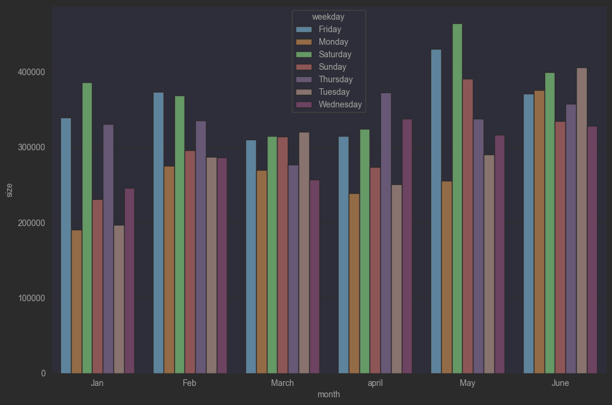
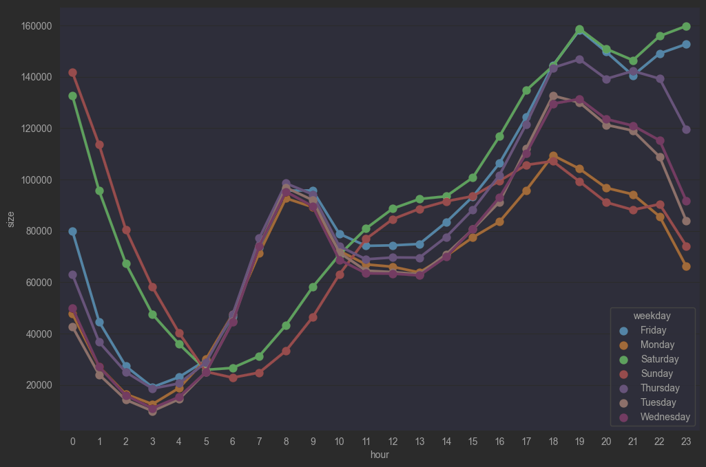

# Uber New York Data Analysis
___

### En este proyecto de análisis de datos, se buscó responder a los siguientes interrogantes:
- ¿Cuál es el mes con mayor cantidad de viajes?.
- ¿Cuáles son los días con mayor actividad?.
- ¿Cuáles son las horas con mayor cantidad de actividad?.

<h3>
Con ello en mente, se prosiguió a realizar el siguiente análisis. El cual, se encuentra perfectamente detallado en el 
notebook titulado: <b>analysis.ipynb</b>.
</h3>

### A modo de resumen, podemos decir que:
## 1 - Mes con mayor cantidad de actividad

---
*Gracias al análisis realizado, se pudo observar que: El mes que presenta mayor cantidad de viajes en la ciudad de Nueva York fue el mes de __junio__, con un total de __2571771__ viajes.*
---
---

## 2 - Días con mayor cantidad de actividad

---
*Gracias al análisis realizado, se pudo observar que: Los días que presenta mayor cantidad de viajes en la ciudad de Nueva York fueron los sábados del mes de __abril__, con un total de __464298__ viajes.*
---
---

## 3 - Horas con mayor cantidad de actividad

---
<h3><b>Con este análisis, se puede observar quelas principales horas pico en cuanto a mayor cantidad de viajes, se presentan los siguientes comportamientos:
<li>La menor demanda de viajes se encuentra a las 5 am sin importar el día.</li>
 
<li>Los días: lunes, martes, miércoles, jueves y viernes presentan un marcado ascenso en la cantidad de viajes desde las 5 am hasta encontrar su primer pico entre las 7 am y las 8 am. (Personas ingresando a sus trabajos)</li>
 
<li>Desde la 1 pm hasta las 7 pm se observa un importante aumento en todos los horarios. (Personas regresando a sus hogares)</li>
 
<li>Los días: viernes y sábados, presentan un último tipo en los horarios correspondientes a partir de las 9 pm. (Esparcimiento)</li>

---